# PIZZERIA EL FORNO

El forno es una página web de un restaurante, donde puedes ver las ofertas que ofrece el establecimiento, el menú con los precios, también puedes pedir comida a domicilio o para recoger en el establecimiento.
La página web está diseñada de la siguiente manera:
- **No está logueado**: solo puede ver las ofertas del establecimiento y los precios de los productos.
- **Usuario**: puede ver las ofertas del establecimiento, los precios del menu, crear sus propias papas y pizzas, añadir los productos al carrito y comprar.
- **Administrador**: puede ver las ofertas del establecimiento, agregar, editar y eliminar los productos, agregar y editar los ingredientes, añadir reservas y eliminarlas y por último, ver los pedidos de los clientes y eliminarlos.

### TECNOLOGÍAS UTILIZADAS

- **Backend**: framework de PHP, Laravel.
- **Base de datos**: MySQL.
- **Frontend**: framework de Typescript, Angular con Bootstrap para el diseño.
- **Despliegue**: docker-compose.

### INSTALACIÓN
- **Frontend**:
1. Movernos a la carpeta frontend/el-forno e instalar las dependencias del package.json

       npm install
2. Ejecutar la aplicación

       npm start

- **Backend**:
1. Movernos a la carpeta backend/elForno e instalar las dependencias del composer.json
  
       composer install

3. Conectarte de manera local

   1. Conéctate a tu vps y ejecuta el comando ***php artisan migrate*** para que cree las tablas y la BBDD.
   2. Ejecuta el comando ***php artisan db:seed*** para rellenar las tablas.

3. Encendemos el servidor

       php artisan serve

### PÁGINAS
       PARA TODOS LOS USUARIOS POR IGUAL:

- **Inicio de sesión y registro**: en esta página el usuario puede iniciar sesión con su correo electrónico y su contraseña, cuando inicia sesión correctamente, se redirije directamente a la página de home, sino, aparece un mensaje de error. A la hora de registrarse, solo se puede registrar como Customer; una vez registrado, se logueará directamente.

   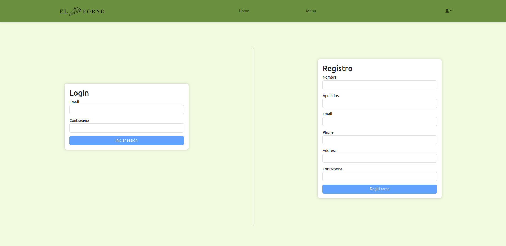

- **Footer**: Aparece los horarios del restaurante, los números de teléfono para reservas y cualquier duda, el logo y el correo electrónico

   

       PARA CUSTOMER Y ADMIN POR IGUAL

- **Home / inicio**: en esta página se puede ver un carrousel de imágenes de la comida del establecimiento y de ofertas que existen si vas a comer al establecimiento.

   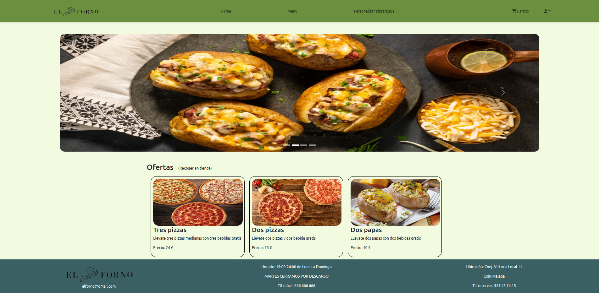

- **Perfil**: En el perfil, tenemos los datos del cliente, para cuando realizan un pedido, coge el número de teléfono, el nombre y la dirección que utilizaremos para cuando haga el pedido y el correo para poder loguearse. El usuario puede editar la información necesaria.

   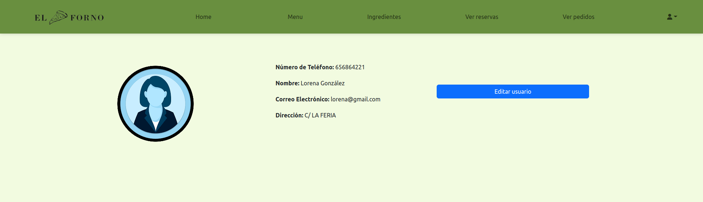

   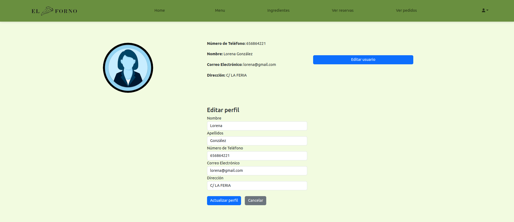

       NO LOGUEADO:

- **Home / inicio**: en esta página se puede ver un carrousel de imágenes de la comida del establecimiento y de ofertas que existen si vas a comer al establecimiento.

   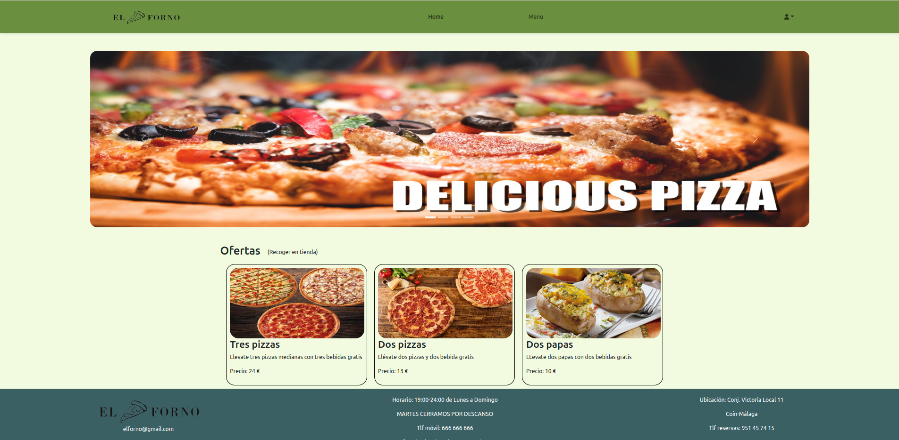

- **Menu**: Lo que te permite es ver los precios que tienen los productos y los ingredientes.

   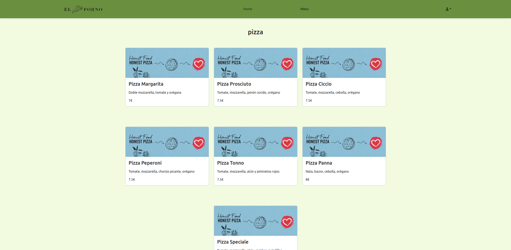

       CUSTOMER

- **Menu** :Te permite ver los precios, los ingredientes y añadirlos al carrito para poder comprarlos.

   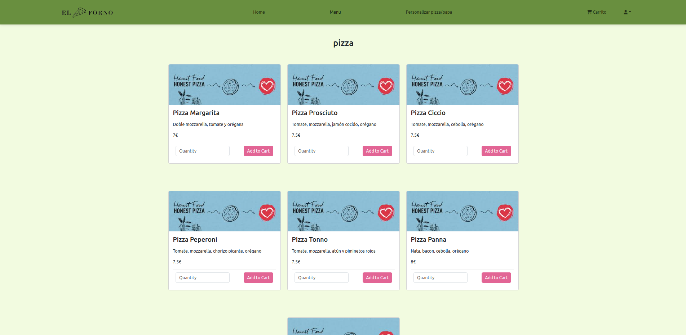

- **Crear Pizza/Papa al gusto**: El usuario puede elegir los ingredientes que quiera y añadirlos al carrito,cuando lo añades al carrito, lo crea como un producto más y le asigna el precio según los ingredientes que tenga, cada ingrediente le suma al precio inicial 0.5 cent. Solo se añade al carrito los productos seleccionados de ese tipo, es decir, si seleccionas ingredientes de la papa y le das al boton de la pizza, los ingredientes de la papa, no se añaden.

   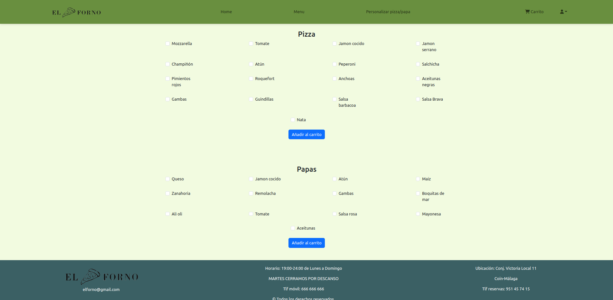

- **Carrito**: CUando el usuario le da a añadir al carrito, aparecen los productos en el carrito, ahí, puedes eliminarles cantidad o eliminarlos directamente del carrito por completo, luego puede decidir si quiere el pedido para recoger o para llevar a domicilio y el total del pedido.

   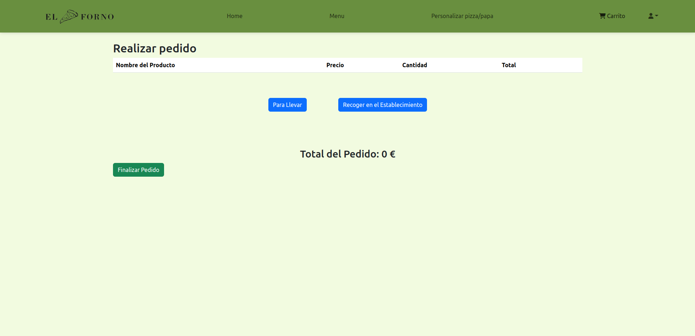

       ADMIN

- **Menu**: El administrador puede agregar los productos dependiendo del tipo (Pizza, Papas, Bebidas, Carne), editarlos y eliminarlos. Al eliminarlos, te piden confirmación para eliminarlos, no sin antes su mensaje de confirmación.

   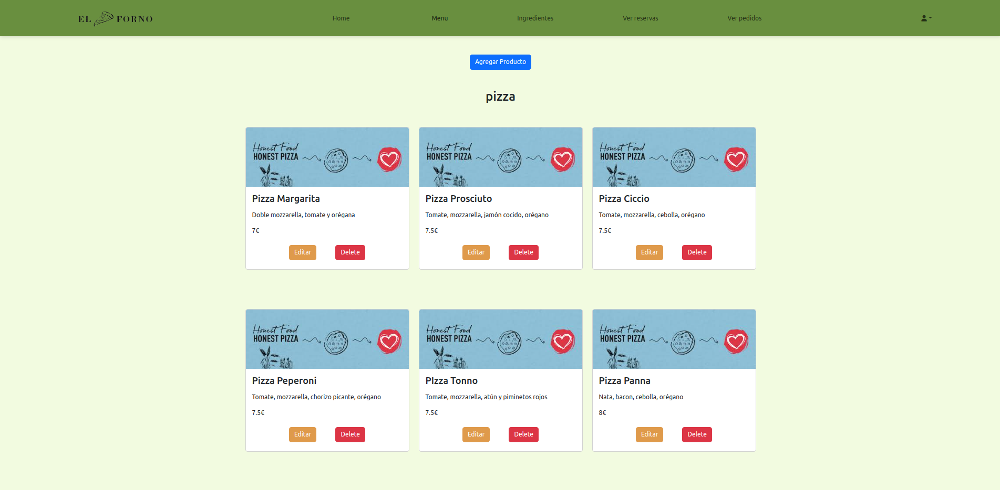

   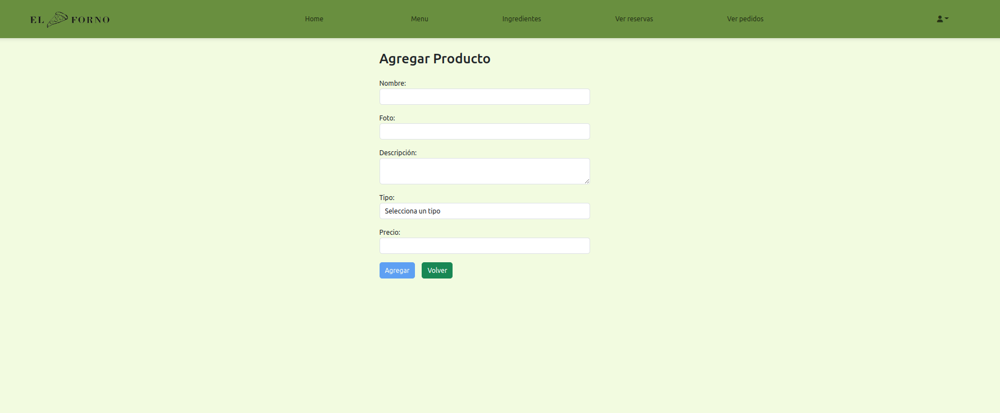

   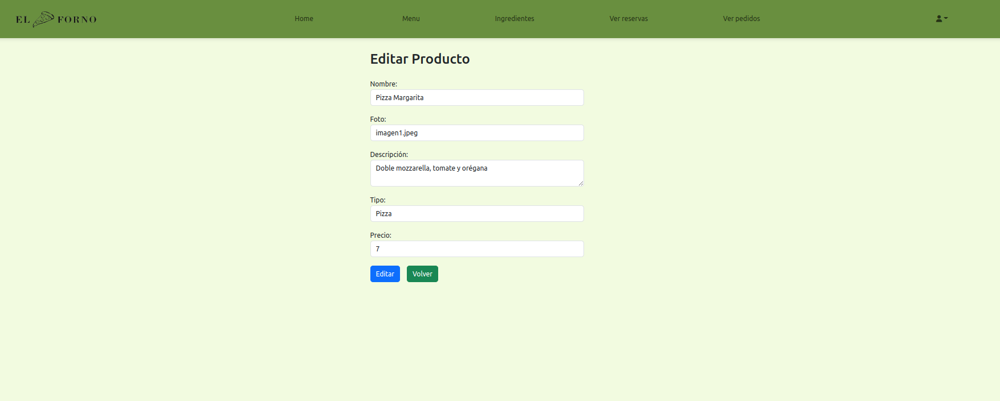

- **Ingredientes**: Aqui el administrador puede eliminar los ingredientes y agregarlos dependiendo del tipo que quiera (Pizza/Papas).

   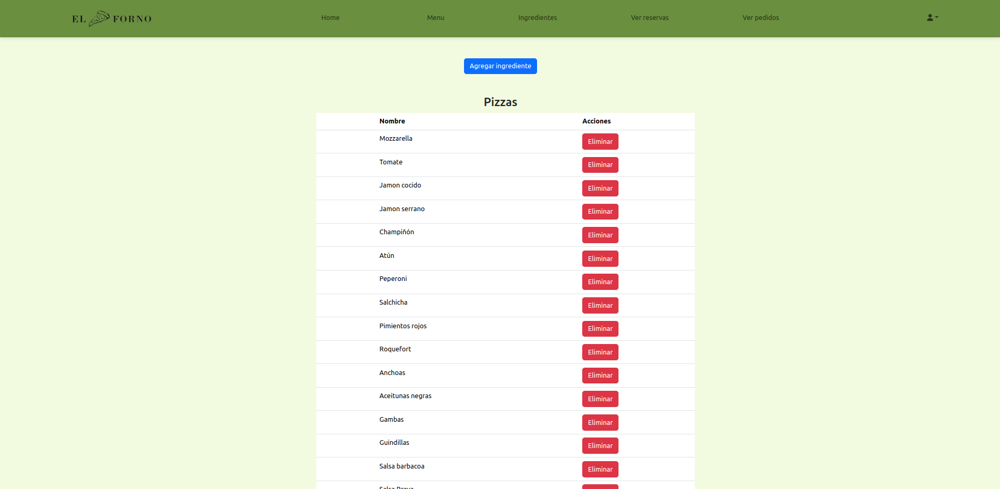

   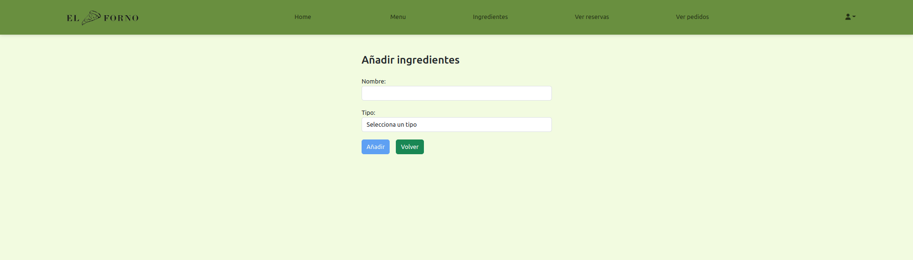

- **Ver reservas**: Los usuarios tendrán que llamar al restaurante para hacer reservas, cuando llaman, el administrador puede crear una reserva. También puede filtrarlos por la fecha y editarlos, por si hay algún problema.

   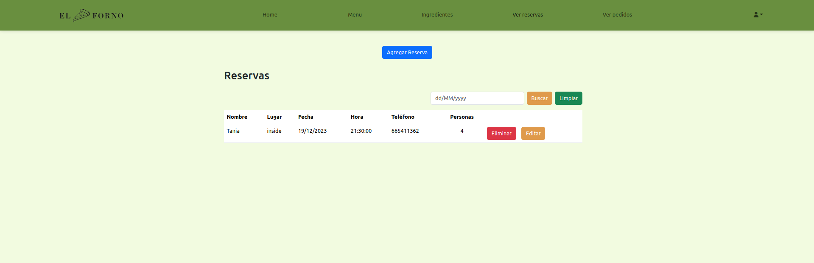

   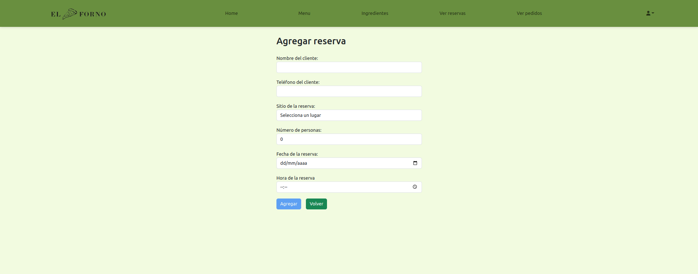

- **Ver pedidos**: El administrador puede ver todos los pedidos realizados por los clientes, donde se clasificarán si es para llevar a la casa o es para ir a recogerlo en tienda, te proporciona la hora para que veas la preferencia de pedidos, una vez realizados, puedes eliminarlos, no sin antes confirmar la eliminación. En los pedidos te aparece solo lo principal, para ver lo que han pedido, necesitas darle a mostrar y te pone todos los productos que han pedido.

   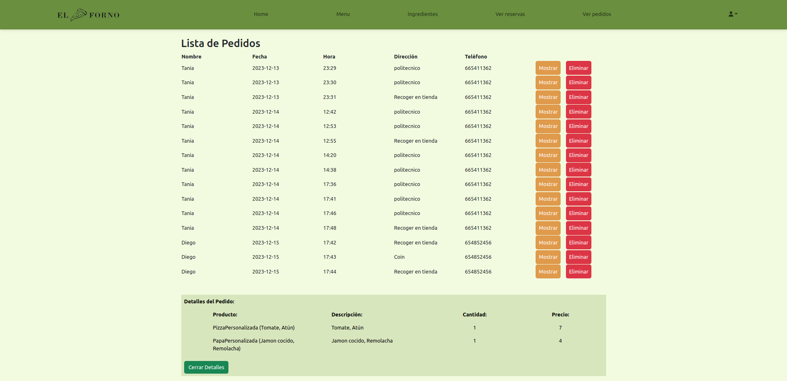
  
